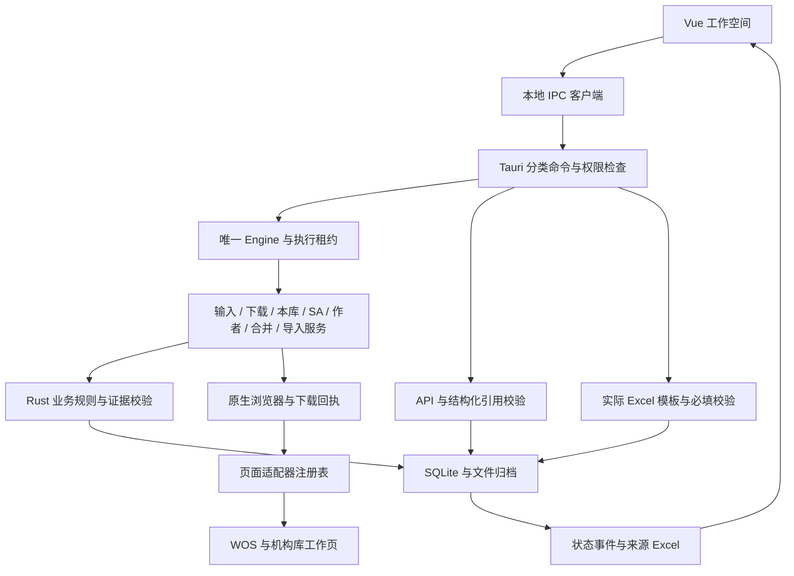

# 工作台完整框架

当前框架已经装配成可运行的应用。业务要求仍以 [TAURI_REBUILD_GOAL.md](TAURI_REBUILD_GOAL.md) 和原始 PPT 为准；实际功能与验收边界见 [TAURI_VERIFICATION.md](TAURI_VERIFICATION.md)。框架完成不表示真实 WOS 或后台业务已经验收。

## 一条贯穿全程的数据链

`名单原表 → SA 任务 / 论文身份 → 来源与文件 → 分支核验 → 材料 → 平台执行 → 结果回读 → 来源报告`

SQLite 是运行状态的唯一来源，Excel 是输入输出载体。Vue 不另存业务进度，页面驱动不决定任务完成。一份论文文件可关联多条 SA 任务，各条 SA 的核验与完成独立保存。



## 代码边界

下列路径除 `core` 外均相对 `desktop`。

| 层 | 入口和责任 |
| --- | --- |
| 桌面启动 | `src-tauri/src/main.rs`：装配窗口、Engine 和分类 IPC，不包含业务操作实现 |
| IPC | `src-tauri/src/commands/`：workspace、tasks、browsers、materials、models 五组命令；统一验证本地窗口，按操作取得执行租约 |
| 应用调度 | `src-tauri/src/engine.rs`：唯一实例、工作空间、并发租约、事件、操作分发 |
| 输入和人工核验 | `engine/input_service.rs`、`review_service.rs`：名单版本确认和有来源的分流；名单读取、迁移入口位于 `commands/workspace.rs` |
| 来源下载 | `engine/downloads.rs`：原始文件、身份核验、队列、失败继续、暂停恢复和文件复用 |
| 本库查询 | `engine/library_service.rs`：完整前端查询与实际候选证据，不把“查无”勾选当成查询结果 |
| SA 核验 | `engine/sa_service.rs`：实时 SA、逐项清单、关联及检查点恢复 |
| 作者和元数据 | `engine/author_service.rs`：工号身份、作者准备、认领和别名；`metadata_service.rs`：完整字段与保存后的回读核验 |
| 重复条目 | `engine/duplicate_service.rs`：候选准备、完整原主条目和依据绑定、合并回读 |
| 导入与写入 | `engine/submission_service.rs`：原文件和批次恢复；`engine/writes.rs`：统一写入边界，完整载荷、持久意图、执行、回读和原子保存 |
| 浏览器执行 | `src-tauri/src/browser.rs`：原生窗口、独立资料目录、导航与来源限制、命令关联、超时、Requested/Finished 下载事件 |
| 页面驱动 | `src-tauri/src/adapters.rs`：绑定角色、脚本与处理函数；WOS/SA/导入复用 `extension` 驱动，其他驱动位于 `src-tauri/browser` |
| 核心业务 | `core/src/model.rs`、`issues.rs`、`sa.rs`、`claim.rs`、`alias.rs`、`metadata.rs`、`merge.rs`、`library.rs`：规则和来源校验，不依赖窗口或 Tauri |
| 存储与恢复 | `core/src/store.rs`、`queue.rs`、`download.rs`、`versions.rs`、`legacy.rs`：事务、原始意图、输入、回执和恢复条件 |
| 文件、模板、AI | `core/src/files.rs`、`templates.rs`、`template_rules.rs`、`catalog.rs` 与 `src-tauri/src/ai.rs`：解析、Excel、实际模板规则、渠道和 API 引用验证 |
| 前端服务 | `src/services/desktop.ts`：闭合的本地命令类型；`composables/useWorkbench.ts`：任务、表单、确认和事件 |
| 前端页面 | `WorkflowOverview.vue`：流程、来源能力、连接与实时数量；`App.vue`：任务详情、材料与设置；`TaskTable.vue`、`WorkbenchShell.vue`：列表和导航 |

所有 `engine/...` 路径相对 `desktop/src-tauri/src`。服务共用同一个 Engine 和 Store，没有建立第二套业务状态。平台写入协调集中在 `writes.rs`，保持所有副作用的一致恢复规则。

## 注册与扩展

`core/src/workflow.rs` 定义 27 个公开任务操作和服务分类：读取、准备、本地核验、恢复、平台写入。Engine 用枚举穷尽分发；新增操作没有接入处理分支会导致编译失败。未知操作在加载或改变任务前拒绝。页面的 `metadata_save`、`duplicate_merge`、`alias_add` 不能当成公开工作流命令调用。

`core/src/framework.rs` 提供框架版本、功能边界、6 个浏览器工作区和 3 类业务流程。`catalog.rs` 是 11 个导入渠道的统一注册来源，AI 与前端都从它读取。检索、原始导出、解析、提交和模板准备分别披露，不把已登记渠道当成已实现驱动。

`workspace` 返回实际注册表、任务、队列和窗口状态。流程总览不创建写入意图，也不把打开窗口当成有访问权限。图书馆入口使用[上海交通大学图书馆数据库列表](https://www.lib.sjtu.edu.cn/f/database/database.shtml)，在 WOS 自己的资料目录内导航；认证由用户完成。

新增来源依次接入：渠道及格式契约 → 页面和下载驱动 → 文件解析、身份与完整来源校验 → 对应平台导入契约 → 模拟与真实验收。不能只修改 `automated` 标记。

新增操作依次接入：公开枚举 → 核心规则 → 服务 → 原始意图与回读 → 页面驱动 → UI 确认 → 权限注册与业务验收。恢复必须读取原载荷，不能用后来改变的表单替代旧意图。

模板以实际文件为准，重复表头使用列位置作为唯一填写键，导出不改原表头。注册及导出均读取说明行和输出行的数据有效性；可解释规则在本地验证，未知规则列为待核对。生成草稿保留有效字段，无效字段留空，模板与输出哈希、输入和 AI 建议绑定后写入任务证据及来源报告。材料导出不改业务阶段；再次分类不会让旧材料成为新建议的成功证明。

## 状态与权限

- 原始匹配数、业务分支、运行阶段和队列结果分别保存。匹配数 2 与 Excel 跳过数字 2 独立。
- `Pending → Searching → Downloading → Downloaded` 仅表示资料获取。核验后才允许 `Ready → Uploaded → Imported → Pushed`；关联、认领和 SA 最终完成分别执行。
- `Unknown` 保留原意图和文件，先阻止新写入，再通过对应回读恢复。
- 未查询到的分支保留未处理；下载或推送成功不能自动完成 SA。
- 正式网页只拥有 `browser_result`。本地工作台才拥有队列、AI、模板和执行命令。“继续队列”和“取消队列”已补齐正式构建命令与权限注册。
- WOS 和机构库使用不同资料目录；机构库工作页共享其机构会话。下载依据原生完成回执进入应用目录，不依赖系统 Downloads。

## 运行与验证

在 `desktop` 安装锁定依赖后，运行 `pnpm desktop` 开发，`pnpm build` 校验前端，`pnpm bundle` 生成安装包；环境准备见 [desktop/README.md](../desktop/README.md)。

从仓库根目录验证：

```text
cargo test --locked --manifest-path desktop/core/Cargo.toml
cargo check --locked --manifest-path desktop/src-tauri/Cargo.toml
cargo test --locked --manifest-path desktop/src-tauri/Cargo.toml
cargo run --quiet --locked --manifest-path desktop/core/Cargo.toml --example framework_manifest
```

在 `desktop` 启动 `pnpm dev` 后，从根目录运行 `node tests/desktop-framework.test.cjs`，核验实际 Rust 注册表、前端客户端、IPC 与权限一致性、实时数量、待确认入口、各模块/渠道展示和 1260/960 布局。该测试使用隔离 IPC，不证明真实登录或下载。

原生完整流程由 `smoke-test` 编译后的程序运行 `tests/desktop-native.test.cjs`，只访问独立本地合成页面。正式编译不包含回环来源覆盖。既有完整进程恢复测试仍保留；合并完整进程恢复验收尚未完成。

## 交付边界

框架已装配，核心服务、浏览器驱动、AI、模板、存储、报告和前端均有实际入口。WOS TXT 是当前唯一接入自动原始导出与平台导入的渠道；其他渠道保留明确的扩展位置。真实 WOS 机构访问、下载和机构后台闭环仍需登录后的独立验收，整体业务目标保持未完成。
