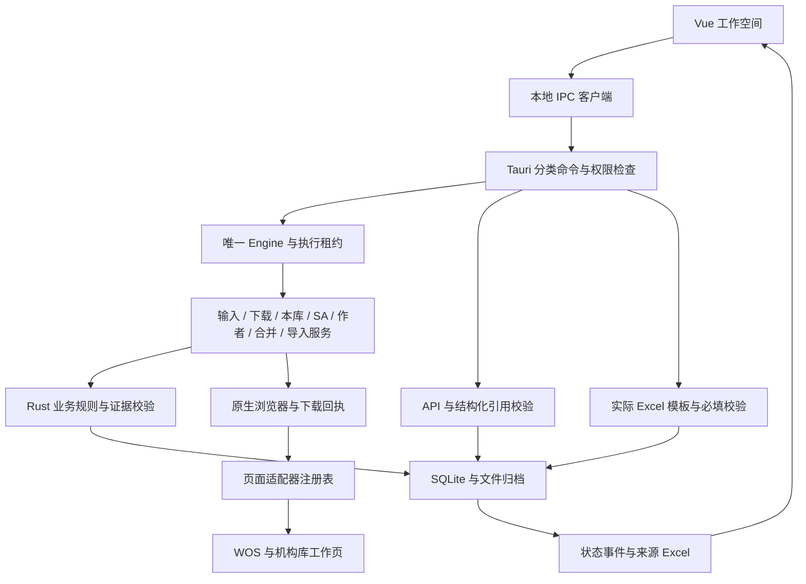

# 工作台完整框架

当前框架已经装配成可运行的应用。业务要求仍以 [TAURI_REBUILD_GOAL.md](TAURI_REBUILD_GOAL.md) 和原始 PPT 为准；实际功能与验收边界见 [TAURI_VERIFICATION.md](TAURI_VERIFICATION.md)。框架完成不表示真实 WOS 或后台业务已经验收。

## 一条贯穿全程的数据链

`名单原表 → SA 任务 / 论文身份 → 来源与文件 → 分支核验 → 材料 → 平台执行 → 结果回读 → 来源报告`

SQLite 是运行状态的唯一来源，Excel 是输入输出载体。Vue 不另存业务进度，页面驱动不决定任务完成。一份论文文件可关联多条 SA 任务，各条 SA 的核验与完成独立保存。



## 代码边界

下列路径除 `core` 外均相对 `desktop`。

| 层 | 入口和责任 |
| --- | --- |
| 桌面启动 | `src-tauri/src/main.rs`：装配窗口、Engine 和分类 IPC，不包含业务操作实现 |
| IPC | `src-tauri/src/commands/`：按名单、任务、浏览器、来源、材料、模型和批次拆分命令；统一验证本地窗口，按操作取得执行租约 |
| 应用调度 | `src-tauri/src/engine.rs`：唯一实例、工作空间、并发租约、事件、操作分发 |
| 输入和人工核验 | `engine/input_service.rs`、`review_service.rs`：名单版本确认和有来源的分流；名单读取、迁移入口位于 `commands/workspace.rs` |
| 来源下载 | `engine/downloads.rs`：原始文件、身份核验、队列、失败继续、暂停恢复和文件复用 |
| 本库查询 | `engine/library_service.rs`：完整前端查询与实际候选证据，不把“查无”勾选当成查询结果 |
| SA 核验 | `engine/sa_service.rs`：实时 SA、逐项清单、关联及检查点恢复 |
| 作者和元数据 | `engine/author_service.rs`：工号身份、作者准备、认领和别名；`metadata_service.rs`：完整字段与保存后的回读核验 |
| 重复条目 | `engine/duplicate_service.rs`：候选准备、完整原主条目和依据绑定、合并回读 |
| 导入与写入 | `engine/submission_service.rs`：原文件和批次恢复；`engine/writes.rs`：统一写入边界，完整载荷、持久意图、执行、回读和原子保存 |
| 浏览器执行 | `src-tauri/src/browser.rs`：原生窗口、独立资料目录、导航与来源限制、命令关联、超时、Requested/Finished 下载事件 |
| 页面驱动 | `src-tauri/src/adapters.rs`：绑定角色、脚本与处理函数；WOS/SA/导入复用 `extension` 驱动，其他驱动位于 `src-tauri/browser` |
| 核心业务 | `core/src/model.rs`、`issues.rs`、`sa.rs`、`claim.rs`、`alias.rs`、`metadata.rs`、`merge.rs`、`library.rs`：规则和来源校验，不依赖窗口或 Tauri |
| 存储与恢复 | `core/src/store.rs`、`queue.rs`、`download.rs`、`versions.rs`、`legacy.rs`：事务、原始意图、输入、回执和恢复条件 |
| 文件、模板、AI | `core/src/files.rs`、`source_files.rs`、`templates.rs`、`template_rules.rs`、`catalog.rs` 与 `src-tauri/src/ai.rs`：原文件接入、Excel、实际模板规则、渠道和 API 引用验证 |
| 批量材料 | `core/src/materials.rs`、`material_batch.rs`、`commands/material_batches.rs` 与 `MaterialBatchPanel.vue`：冻结零匹配范围、原始导出优先、模板产品、来源与文件回执、暂停恢复 |
| 提交准备 | `core/src/submission.rs`、`commands/submission.rs` 与 `SubmissionMaterial.vue`：本篇材料选择、渠道/机构/说明、来源版本绑定、业务前置条件与现有 WOS 写入边界衔接；新增代码暂未验证 |
| 前端服务 | `src/services/desktop.ts`：闭合的本地命令类型；`composables/useWorkbench.ts`：任务、表单、确认和事件 |
| 前端页面 | `WorkflowOverview.vue`：流程、来源能力、连接与实时数量；`App.vue`：任务详情、材料与设置；`TaskTable.vue`、`WorkbenchShell.vue`：列表和导航 |

所有 `engine/...` 路径相对 `desktop/src-tauri/src`。服务共用同一个 Engine 和 Store，没有建立第二套业务状态。平台写入协调集中在 `writes.rs`，保持所有副作用的一致恢复规则。

## 注册与扩展

`core/src/workflow.rs` 定义 28 个公开任务操作和服务分类：读取、准备、本地核验、恢复、平台写入。Engine 用枚举穷尽分发；新增操作没有接入处理分支会导致编译失败。未知操作在加载或改变任务前拒绝。页面的 `metadata_save`、`duplicate_merge`、`alias_add` 不能当成公开工作流命令调用。

`core/src/framework.rs` 提供框架版本、功能边界、6 个浏览器工作区和 3 类业务流程。`catalog.rs` 是 11 个导入渠道的统一注册来源，AI 与前端都从它读取。检索、原始导出、数据库解析、提交、模板准备和本地来源读取分别披露，不把已登记渠道当成已实现驱动。

`workspace` 返回实际注册表、任务、队列和窗口状态。流程总览不创建写入意图，也不把打开窗口当成有访问权限。图书馆入口使用[上海交通大学图书馆数据库列表](https://www.lib.sjtu.edu.cn/f/database/database.shtml)，在 WOS 自己的资料目录内导航；认证由用户完成。

新增来源依次接入：渠道及格式契约 → 页面和下载驱动 → 文件解析、身份与完整来源校验 → 对应平台导入契约 → 模拟与真实验收。不能只修改 `automated` 标记。

新增操作依次接入：公开枚举 → 核心规则 → 服务 → 原始意图与回读 → 页面驱动 → UI 确认 → 权限注册与业务验收。恢复必须读取原载荷，不能用后来改变的表单替代旧意图。

模板以实际文件为准，重复表头使用列位置作为唯一填写键，导出不改原表头。注册及导出均读取说明行和输出行的数据有效性；可解释规则在本地验证，未知规则列为待核对。生成草稿保留有效字段，无效字段留空，模板与输出哈希、输入和 AI 建议绑定后写入任务证据及来源报告。材料导出不改业务阶段；再次分类不会让旧材料成为新建议的成功证明。

### 批量材料整理

本地 `prepare_material_batch`、`resume_material_batch`、`cancel_material_batch` 与已有全局暂停入口共用唯一 Engine 租约，运行服务标为 `materials`。SQLite `material_batches` 保存原负责人、顺序、完整名单、原 Artifact、输入/来源/建议哈希、实际模板要求和逐篇结果，只允许一份未结束的材料范围。原范围中的逐篇失败继续；存储故障暂停，重启将运行范围转为待继续，不自动执行。

已有原始导出重新解析并核验原字节与身份后优先复制，身份未确认不能改用模板绕过。其他论文按保存建议的模板 ID 读取实际注册文件，要求完整来源和模板语义匹配的 AI 审计。模板 ID、必填列、规则和补充说明参与比较；读取实际模板时不会重复附加相同原文说明。只有重复且完全相同的自动说明块可归一化，不同说明不能合并。单篇导出与 AI 缓存也检查实际模板及完整来源审计。

`materials/products/<recipe SHA256>` 中的 `intent.json`、`prepared.json`、产品和 `来源.json` 分别记录冻结事实、发布前回执、原字节/模板结果和完整字段来源。发布前复查资料、实际模板与验证结论；恢复时检查原回执、哈希及实际填写单元格。未填写的可选列也清空示例值。发布后游标更新前退出，可以复用同一文件和保存审计，不生成第二份或重复增加证据；被修改的产品、来源记录或回执保留并拒绝采纳。

批次退出或完成时生成 `materials/batches/<批次 ID>/材料与来源.xlsx`。材料文件索引包含原行号、题名、类型、文件与回执路径、哈希、缺项、格式问题、待核对要求和失败原因；完整原范围与结果按 15000 字符分段并附完整 SHA256。全局来源报告同时保留全部历史材料范围。整理不调用 API、不发送平台写入、不提升业务阶段；原始导出、字段通过和草稿都仍需后续业务核对。这里验证的是核心数据库/文件重开恢复及隔离前端，尚未宣称材料批次已通过完整原生程序强制退出测试。

### 本篇提交材料准备（代码阶段，暂未验证）

单篇模板导出与批量整理使用同一 `materials` 产品发布逻辑。单篇明确选定实际模板后，`prepare_template` 发布管理文件、完整来源及回执，`export_copy` 保存用户副本和独立导出依据；副本不替代产品文件，也不作为 AI 新证据。外部副本失败不删除已经发布的产品。自动批次仍原始导出优先，单篇模板也不能绕过已有原文件的身份与字节核验。这个统一入口暂未运行验证。

新增本地 `submission_options` 和 `prepare_submission` IPC，在论文的“平台操作”页明确选择材料。已核验 Artifact 可以直接准备当前版本的原始材料副本；已生成模板依据 `material_validation` 产品审计选择，旧版本、草稿、改动文件或缺失来源不能当作可提交材料。选择结果包括完整原名单、输入/来源/建议版本、产品回执与文件哈希、渠道、成果类型建议、所属机构和 `SA补充-<SA ID>` 导入说明。

提交准备记录作为 `submission_packet_v1` 保存到原任务证据，与任务保存共用事务；最新一份准备记录是后续选择依据，不建立第二套上传状态。它不进入 AI 原文来源，避免准备记录反过来充当自身的事实证据。界面可刷新当前可用材料、明确选择文件、查看完整文件/来源位置及仍缺少的业务条件。后端按当前资料版本核对，任务切换或版本更新后前端不沿用旧选择。

准备只生成本地交接记录，不上传或提升阶段。WOS TXT 的现有上传边界核对所选材料与当前 Artifact；原准备记录一并归入平台写入意图，上传仍执行本库重查和 SA 回读。通用模板对应 `general` 渠道，页面驱动未接通时明确返回待接入条件；生成 Excel 和字段通过都不当作平台已接收。按用户要求本阶段没有运行测试、类型检查或安装包构建，也未读取到真实机构导入窗口；本层的编译、交互和恢复均待后续验证。

报告的“提交材料记录”工作表按 SA 保留最新与历史选择、实际渠道和导入说明、产品文件与来源回执、保存/当前输入版本及完整依据 ID/SHA256。“原始来源依据”保留完整分段 JSON。此报告记录保存快照，名单一致不代表当前文件、来源或平台接收结果已重新核验。

### 原始文件接入

本地接入不依赖 WOS 记录模型。`commands/sources.rs` 提供 `preview_source_file`、`source_file_page`、`attach_source_file` 三个本地 IPC；`SourceImporter.vue` 在任务“来源”页连接这些入口。渠道允许的 Excel、CSV、TXT 格式取自同一注册表，原始字节存入工作目录 `source-files/<SHA-256>.<扩展名>`。原文件最大 16 MB、展开 XLSX 最大 64 MB、最多 200000 个单元格；完整选中记录最大 1 MB，超限拒绝，不截断字段。

Excel/CSV 明确选择工作表、实际表头行和一条论文记录，再映射原文题名及可选 DOI/WOS 列。重复或空表头按真实列位置保存，原记录全部字段进入来源，公式结果拒绝作为原始数据库记录。CSV 可选择逗号、分号、制表符，保留引号中的换行；文本支持 UTF-8、GB18030 和 UTF-16，BOM 记录实际解码方式，乱码拒绝采纳。TXT 明确选择连续起止行并填写范围内真实题名，仅该范围进入 AI。

绑定须保存具体对应依据与人工确认，已映射的 DOI/WOS 与名单冲突时拒绝。预览记录保存在 SQLite，重开后按同条任务和版本恢复；已绑定或任务版本改变的预览不能重复绑定。来源保存为 `external_metadata`，包括原文件、哈希、渠道、实际编码、所有选中字段/文本、行列位置、输入版本和绑定依据。不会创建 WOS Artifact，也不会自动确认论文身份、交大归属或改变业务阶段。

API 请求前、返回采纳前和模板导出前都重新读取归档并核对选中内容；旧输入来源不进入当前 AI 引用，材料校验结果不作为事实来源。来源 Excel 保留完整记录及原文件/哈希对应关系，长摘要与依据分段后仍可完整重建。该通用容器读取不是各数据库语义解析器，不替代非 WOS 网站自动导出或平台导入驱动。

## 状态与权限

- 原始匹配数、业务分支、运行阶段和队列结果分别保存。匹配数 2 与 Excel 跳过数字 2 独立。
- `Pending → Searching → Downloading → Downloaded` 仅表示资料获取。核验后才允许 `Ready → Uploaded → Imported → Pushed`；关联、认领和 SA 最终完成分别执行。
- `Unknown` 保留原意图和文件，先阻止新写入，再通过对应回读恢复。
- 未查询到的分支保留未处理；下载或推送成功不能自动完成 SA。
- 正式网页只拥有 `browser_result`。本地工作台才拥有队列、AI、模板和执行命令。“继续队列”和“取消队列”已补齐正式构建命令与权限注册。
- WOS 和机构库使用不同资料目录；机构库工作页共享其机构会话。下载依据原生完成回执进入应用目录，不依赖系统 Downloads。

## 运行与验证

在 `desktop` 安装锁定依赖后，运行 `pnpm desktop` 开发，`pnpm build` 校验前端，`pnpm bundle` 生成安装包；环境准备见 [desktop/README.md](../desktop/README.md)。

从仓库根目录验证：

```text
cargo test --locked --manifest-path desktop/core/Cargo.toml
cargo check --locked --manifest-path desktop/src-tauri/Cargo.toml
cargo test --locked --manifest-path desktop/src-tauri/Cargo.toml
cargo run --quiet --locked --manifest-path desktop/core/Cargo.toml --example framework_manifest
```

在 `desktop` 启动 `pnpm dev` 后，从根目录运行 `node tests/desktop-framework.test.cjs`，核验实际 Rust 注册表、前端客户端、IPC 与权限一致性、实时数量、待确认入口、各模块/渠道展示和 1260/960 布局。该测试使用隔离 IPC，不证明真实登录或下载。

`node tests/desktop-sources-ui.test.cjs` 验证原文件渠道/编码设置、明确记录/范围/列选择、分页和表头刷新、来源确认、版本清理、恢复入口及异步返回的任务隔离。`node tests/desktop-materials-ui.test.cjs` 验证模板材料和校验展示。这些测试均使用隔离 IPC，未操作真实数据库或平台。

旧版迁移读取标准 `runtime/classification/<signature>/分类结果.json`、`runtime/submission/<signature>/提交准备.json` 和提交准备的 `progress.json`，保留完整来源字段与引用，以及标准伴随文件、草稿和明确引用的 TXT/CSV/XLSX。仅名单字节哈希、Python 论文键、题名、DOI、全部行号和零匹配队列一致时绑定当前任务；不一致的历史完整保存在批次归档。分类断点没有完整名单依据时仅归档原文件，不推断对应任务。历史材料不改变当前任务阶段，不成为 AI/模板的事实来源。

独立旧作者认领迁入 `legacy_claim` 未确认意图，`verify_legacy_claim` 从同一迁移版本的“认领已核验”完整事件恢复目标；此前迁入 `legacy_sa` 的独立认领也可读取原数据库快照，无需迁移第二次。回读要求准确 SA/名单版本、完整作者 ID、学者/工号及全部作者、关系、元数据一致，前后 SA 也须一致。仅记录姓名和顺序的旧意图不能自动确认。恢复仅进入 `Claimed`，不设置 SA 已处理或重发认领；新增恢复代码尚未测试或现场验证。

归档在应用目录 `legacy-files/<sha256>.<ext>`，同时保存原路径、实际文件哈希和大小。预览后原内容改变、重复论文 ID、原导出哈希不符或现存归档被修改时拒绝迁移，SQLite 事务不提交。迁移只扫描标准签名目录及明确引用，单文件 20 MB、总量 256 MB；超限提示缩小范围，不截断。原绝对路径文件缺失时记录缺项，存在但超出所选旧目录时拒绝。不会搜索同名文件猜测来源。

`node tests/desktop-legacy-materials-ui.test.cjs` 验证只有材料的预览、严格预览确认、断点/未绑定提示、保存位置与哈希及 1260/960 布局。核心迁移测试覆盖实际 SQLite 重开、幂等、完整长摘要和引用、原字节归档、材料不提升阶段、错误拒绝及 Excel 分段重组。来源报告的“旧版资料归档”保存完整历史 JSON；按批次/分段顺序连接后可用记录 SHA256 核对，未绑定资料也保留。

原生完整流程由 `smoke-test` 编译后的程序运行 `tests/desktop-native.test.cjs`，只访问独立本地合成页面。正式编译不包含回环来源覆盖。完整合并进程恢复由 `tests/desktop-merge-restart.test.cjs` 验证，12 个实际程序进程及其 WebView2：外部模拟服务收到写入后结束测试自建进程，重启核对原意图、SA、候选池和完整主条目。三条原匹配先合并一条，剩余第三条继续独立核对；两次合并各仅一次，SA 不提前完成。字段/SA/候选/检索条件变化或实际未保存时保持未知，不重发。它证明本地模拟恢复，不证明真实机构平台恢复。

从仓库根目录构建并运行独立合并测试（Windows / WebView2）：

```text
cargo build --locked --manifest-path desktop/src-tauri/Cargo.toml --features smoke-test --target-dir desktop/src-tauri/target/merge-restart
node tests/desktop-merge-restart.test.cjs
```

测试默认使用这个独立目录下的程序；`DESKTOP_TEST_BINARY` 可指定已编译的测试程序。不要把带 `smoke-test` 的程序作为正式交付包。

## 交付边界

AI 分类现在使用本地登记的成果类型和导入渠道，允许类型/渠道返回 `null`（待判定），要求高/中/低模型置信度、分类理由、渠道推荐条件、待补项和具体来源引用。置信度是模型建议，不是独立核验的正确率。名单输入可直接开始分类；提供给 API 的名单依据仅含原题名、DOI、WOS ID 和版本标识。仅名单引用必须低置信度并列出待补依据，模板中只允许照录对应题名/标识符列，不能据此补写作者、单位或出版信息。

API 返回须为唯一正常完成的结果；截断、拒绝、工具调用、非法类型/置信度、未知渠道或无效引用均不采纳。请求返回后重新核对任务、实际来源和模板原字节。分类按当前名单指纹和模板哈希保存；旧结果没有这些版本和置信信息时，填写前要求重新分类。每次采纳保存完整建议、来源和模板快照，明确 `review_required=true`、`platform_verified=false`，不提升任务阶段。历史 AI 输出不作为下一次请求的事实依据。

来源报告增加模型置信度、分类理由、渠道条件和待复核状态。长 AI 填写值在“AI 字段来源”按 Unicode 分段保存，包含片段序号与完整值 SHA256；按 SA、模板、字段和顺序连接即可完整恢复。`node tests/desktop-ai-ui.test.cjs` 验证仅名单入口、待判定、低置信度、待补项、模板选择、拒绝结果保留旧建议、完整分类记录和宽/窄窗口。核心测试验证完整响应契约、来源/版本、实际 SQLite 重开和完整 Excel 重组；未调用真实付费 API，不把隔离测试当作实际模型效果验收。

## 批量 AI 调度

`core/src/ai_queue.rs` 保存独立的原范围、任务原记录/版本、来源哈希、模型基础地址/名称和实际模板快照；`src-tauri/src/ai.rs` 执行逐篇 API 调用。`run_ai_queue`、`resume_ai_queue`、`pause_ai_queue`、`cancel_ai_queue` 只开放给本地工作台。Engine 的同一执行锁约束下载、AI 与平台操作；快照披露正在运行的服务，全局暂停同步保存下载与 AI 的暂停请求。模型请求尚未结束时，前端允许发出暂停而不丢失当前结果。

来源与配置在每次请求前核对，请求的完整事实输入在派发前持久保存。有效结果绑定队列/请求身份、原输入、来源、模板与模型，并保存完整审计；结果与队列游标分别落盘时，启动恢复只接受对应的完整结果和仍一致的来源。结果未保存则记录 `unconfirmed`、保留原输入并推进到下一项，显式继续也不重发它。普通逐篇失败继续，认证/限流/服务/网络/配置/模板问题阻塞后续项；配置变化不能偷换原范围。相同版本的建议只有通过完整来源与审计核对才可复用。

“AI 批量结果”报告页保存完整队列 JSON，包括所有原记录、请求输入与逐篇结果。Unicode 内容分段并附完整 SHA256，不保存 API 密钥。界面折叠新范围配置，已有范围始终显示原负责人、范围、模型、模板和进度。批量仅产生待复核建议，材料导出需逐篇校验，业务阶段不自动变化。`tests/desktop-ai-queue-ui.test.cjs` 使用隔离 IPC 检查开始参数、运行中暂停、范围保留、恢复 ID、限流与未知请求提示、不同服务的暂停以及 1260/960 布局。核心测试检查 SQLite 重开恢复与长 Unicode Excel 重组；真实模型质量未验收。

`tests/desktop-ai-restart.test.cjs` 补充 9 个实际原生程序进程的验收：独立本地 HTTP API 接收完整请求，生产 HTTP 客户端、响应校验与队列执行，强制结束测试自建程序及其子进程 后用原目录重启。未保存请求标为待核对、结果与游标之间的中断只采纳对应完整结果一次，暂停和限流保留剩余原范围，三次普通失败后第四篇继续。新增任务存在但不混入原范围，全部 SA 仍待处理、无平台写入。API 配置替换和中断钩子仅在 `smoke-test` 编译中存在，并且只接受明确的回环地址/测试阶段；不读系统密钥、不调用真实模型。普通程序的配置、密钥和 HTTP 路径保持原行为。

复现（保持 `pnpm dev` 开启）：

```text
cargo build --locked --manifest-path desktop/src-tauri/Cargo.toml --features smoke-test --target-dir desktop/src-tauri/target/merge-restart
node tests/desktop-ai-restart.test.cjs
python tests/desktop-ai-report-audit.py <输出的 ai-restart-acceptance.json 路径>
```

独立 Python 审计直接读取 SQLite 与 XLSX XML，比较五个原范围、20 次真实本地 HTTP 输入、完整长 Unicode 原文、原始文字工号、各分类完整审计、Excel 分段顺序/哈希和无平台写入。该过程证明实际原生/HTTP/保存/恢复链路，不证明真实供应商模型质量。

框架已装配，核心服务、浏览器驱动、本地原始来源、AI、模板、存储、报告和前端均有实际入口。WOS TXT 是当前唯一接入自动原始导出与平台导入的渠道；其他渠道可接入符合登记格式的本地原文件，网站自动导出与平台导入保留扩展位置。真实 WOS 机构访问、下载和机构后台闭环仍需登录后的独立验收，整体业务目标保持未完成。
